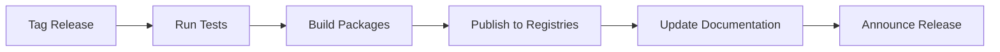

# Software Design Document: Multi-Language SDK Support

**Version**: 1.0.0
**Package**: `sdk-*` (multi-language)
**Status**: Specification (Not Yet Implemented)
**Last Updated**: 2024-11-23
**Author**: AuthZ Engine Team

---

## 1. Overview

### 1.1 Purpose

This document specifies the design for multi-language SDK support in the AuthZ Engine. The goal is to provide native, idiomatic client libraries for Python, Go, Java, Ruby, and .NET that maintain full API parity with the TypeScript SDK while following each language's best practices and conventions.

### 1.2 Scope

**In Scope:**
- Python SDK with async/sync clients
- Go SDK with context-aware patterns
- Java SDK with reactive and blocking clients
- Ruby SDK with Rails integration
- .NET SDK with C# async/await patterns
- Shared protobuf definitions
- Code generation strategy
- Testing and documentation standards
- Publishing and versioning strategy

**Out of Scope:**
- Mobile SDKs (iOS/Android native)
- Browser-only JavaScript SDK (use TypeScript SDK)
- Legacy language versions (Python 2, Java 7, etc.)

### 1.3 Supported Languages

| Language | Minimum Version | Package Manager | Status |
|----------|-----------------|-----------------|--------|
| Python | 3.9+ | PyPI | Planned |
| Go | 1.21+ | Go Modules | Planned |
| Java | 17+ | Maven Central | Planned |
| Ruby | 3.1+ | RubyGems | Planned |
| .NET | 6.0+ | NuGet | Planned |
| TypeScript | 5.0+ | npm | Implemented |

---

## 2. Requirements

### 2.1 Functional Requirements

| ID | Requirement | Priority | Status |
|----|-------------|----------|--------|
| FR-001 | Full API parity with TypeScript SDK | Must Have | Planned |
| FR-002 | Support both gRPC and REST transports | Must Have | Planned |
| FR-003 | Idiomatic code for each language | Must Have | Planned |
| FR-004 | Type-safe interfaces | Must Have | Planned |
| FR-005 | Streaming support for explanations | Should Have | Planned |
| FR-006 | Connection pooling and reuse | Should Have | Planned |
| FR-007 | Framework integrations (FastAPI, Spring, Rails) | Should Have | Planned |
| FR-008 | Retry logic with exponential backoff | Must Have | Planned |
| FR-009 | Circuit breaker pattern | Should Have | Planned |
| FR-010 | Health check support | Must Have | Planned |

### 2.2 Non-Functional Requirements

| ID | Category | Requirement | Target |
|----|----------|-------------|--------|
| NFR-001 | Performance | Client overhead | < 1ms |
| NFR-002 | Performance | Connection reuse | Yes |
| NFR-003 | Reliability | Retry on transient errors | 3 attempts |
| NFR-004 | Security | TLS support | Required |
| NFR-005 | Security | mTLS support | Optional |
| NFR-006 | Compatibility | API version support | v1 |
| NFR-007 | Documentation | Code coverage | 80%+ |
| NFR-008 | Documentation | API reference docs | Required |

---

## 3. Architecture

### 3.1 SDK Architecture Overview

```
                     ┌─────────────────────────────────────────────────────┐
                     │              Application Layer                       │
                     │  ┌─────────┐ ┌─────────┐ ┌─────────┐ ┌─────────┐   │
                     │  │ FastAPI │ │ Spring  │ │  Rails  │ │ ASP.NET │   │
                     │  │   App   │ │   Boot  │ │   App   │ │  Core   │   │
                     │  └────┬────┘ └────┬────┘ └────┬────┘ └────┬────┘   │
                     └───────┼───────────┼───────────┼───────────┼────────┘
                             │           │           │           │
                     ┌───────┼───────────┼───────────┼───────────┼────────┐
                     │       ▼           ▼           ▼           ▼        │
                     │    ┌────────────────────────────────────────┐      │
                     │    │         Framework Integrations          │      │
                     │    │  FastAPI Deps │ Spring Boot │ Rails    │      │
                     │    └─────────────────────┬──────────────────┘      │
                     │                          │                          │
                     │    ┌─────────────────────▼──────────────────────┐  │
                     │    │              Language SDKs                  │  │
                     │    │  ┌────────┐ ┌────────┐ ┌────────┐ ┌──────┐ │  │
                     │    │  │ Python │ │   Go   │ │  Java  │ │ Ruby │ │  │
                     │    │  │  SDK   │ │  SDK   │ │  SDK   │ │ SDK  │ │  │
                     │    │  └───┬────┘ └───┬────┘ └───┬────┘ └──┬───┘ │  │
                     │    └──────┼──────────┼──────────┼─────────┼─────┘  │
                     │           │          │          │         │        │
                     │    ┌──────▼──────────▼──────────▼─────────▼─────┐  │
                     │    │           Shared Proto Definitions          │  │
                     │    │              authz/v1/*.proto                │  │
                     │    └─────────────────────┬───────────────────────┘  │
                     │                          │                          │
                     └──────────────────────────┼──────────────────────────┘
                                                │
                              ┌─────────────────┼─────────────────┐
                              │                 │                 │
                              ▼                 ▼                 ▼
                     ┌──────────────┐  ┌──────────────┐  ┌──────────────┐
                     │    gRPC      │  │     REST     │  │   Hybrid     │
                     │  Transport   │  │  Transport   │  │  Transport   │
                     └──────┬───────┘  └──────┬───────┘  └──────┬───────┘
                            │                 │                 │
                            └─────────────────┼─────────────────┘
                                              │
                                              ▼
                                    ┌──────────────────┐
                                    │  AuthZ Engine    │
                                    │     Server       │
                                    │  (gRPC + REST)   │
                                    └──────────────────┘
```

### 3.2 Code Generation vs Hand-Written

| Component | Approach | Rationale |
|-----------|----------|-----------|
| Proto types | Generated | Consistency, auto-updates |
| gRPC clients | Generated | Protocol compliance |
| REST clients | Hand-written | Better ergonomics |
| Framework integrations | Hand-written | Language-specific patterns |
| Error types | Hand-written | Idiomatic exceptions |
| Retry logic | Hand-written | Language-specific patterns |

### 3.3 Shared Protobuf Definitions

All SDKs share the same proto definitions located at:

```
proto/
├── authz/
│   └── v1/
│       ├── authz.proto          # Core service definitions
│       ├── types.proto          # Shared types
│       ├── agentic.proto        # Agentic features
│       └── health.proto         # Health check service
└── buf.yaml                     # Buf configuration
```

---

## 4. SDK Languages

### 4.1 Python SDK (`authz-engine-python`)

#### 4.1.1 Package Structure

```
authz-engine-python/
├── src/
│   └── authz_engine/
│       ├── __init__.py
│       ├── client.py            # Main client classes
│       ├── async_client.py      # Async client implementation
│       ├── sync_client.py       # Sync client implementation
│       ├── types.py             # Type definitions
│       ├── errors.py            # Exception classes
│       ├── retry.py             # Retry logic
│       └── _generated/          # Generated proto stubs
│           └── authz/
│               └── v1/
├── tests/
├── examples/
├── pyproject.toml
└── README.md
```

#### 4.1.2 Interface Design

```python
from typing import Optional, Dict, List, Any
from dataclasses import dataclass
from enum import Enum


class Effect(Enum):
    """Authorization effect."""
    ALLOW = "EFFECT_ALLOW"
    DENY = "EFFECT_DENY"


@dataclass
class Principal:
    """Principal making the authorization request."""
    id: str
    roles: List[str]
    attributes: Dict[str, Any] = None

    def __post_init__(self):
        if self.attributes is None:
            self.attributes = {}


@dataclass
class Resource:
    """Resource being accessed."""
    kind: str
    id: str
    attributes: Dict[str, Any] = None

    def __post_init__(self):
        if self.attributes is None:
            self.attributes = {}


@dataclass
class ActionResult:
    """Result for a single action check."""
    effect: Effect
    policy: str
    matched_rule: Optional[str] = None


@dataclass
class CheckResult:
    """Result of an authorization check."""
    request_id: str
    results: Dict[str, ActionResult]

    @property
    def allowed(self) -> bool:
        """Check if all actions were allowed."""
        return all(r.effect == Effect.ALLOW for r in self.results.values())

    def is_allowed(self, action: str) -> bool:
        """Check if a specific action is allowed."""
        result = self.results.get(action)
        return result is not None and result.effect == Effect.ALLOW


@dataclass
class ClientConfig:
    """Configuration for the AuthZ client."""
    server_url: str
    grpc_url: Optional[str] = None
    timeout: float = 5.0
    max_retries: int = 3
    backoff_factor: float = 0.1
    tls_cert_path: Optional[str] = None
    tls_key_path: Optional[str] = None
    tls_ca_path: Optional[str] = None
    headers: Optional[Dict[str, str]] = None


class AuthzError(Exception):
    """Base exception for AuthZ errors."""
    def __init__(self, message: str, status_code: Optional[int] = None):
        super().__init__(message)
        self.status_code = status_code


class AuthzConnectionError(AuthzError):
    """Connection error to AuthZ server."""
    pass


class AuthzTimeoutError(AuthzError):
    """Timeout error for AuthZ request."""
    pass
```

#### 4.1.3 Async Client

```python
import asyncio
from typing import Optional, Dict, List, Any, AsyncIterator

import httpx
import grpc.aio


class AsyncAuthzClient:
    """Async client for AuthZ Engine."""

    def __init__(self, config: ClientConfig):
        """Initialize async client.

        Args:
            config: Client configuration
        """
        self._config = config
        self._http_client: Optional[httpx.AsyncClient] = None
        self._grpc_channel: Optional[grpc.aio.Channel] = None

    async def __aenter__(self) -> "AsyncAuthzClient":
        """Async context manager entry."""
        await self.connect()
        return self

    async def __aexit__(self, *args) -> None:
        """Async context manager exit."""
        await self.close()

    async def connect(self) -> None:
        """Establish connection to AuthZ server."""
        self._http_client = httpx.AsyncClient(
            base_url=self._config.server_url,
            timeout=self._config.timeout,
            headers=self._config.headers or {},
        )

        if self._config.grpc_url:
            self._grpc_channel = grpc.aio.insecure_channel(
                self._config.grpc_url
            )

    async def close(self) -> None:
        """Close connections."""
        if self._http_client:
            await self._http_client.aclose()
        if self._grpc_channel:
            await self._grpc_channel.close()

    async def check(
        self,
        principal: Principal,
        resource: Resource,
        actions: List[str],
        *,
        aux_data: Optional[Dict[str, Any]] = None,
    ) -> CheckResult:
        """Check authorization for multiple actions.

        Args:
            principal: Principal making the request
            resource: Resource being accessed
            actions: List of actions to check
            aux_data: Optional auxiliary data (JWT claims, etc.)

        Returns:
            CheckResult with per-action results

        Raises:
            AuthzError: If authorization check fails
        """
        request = {
            "principal": {
                "id": principal.id,
                "roles": principal.roles,
                "attributes": principal.attributes,
            },
            "resource": {
                "kind": resource.kind,
                "id": resource.id,
                "attributes": resource.attributes,
            },
            "actions": actions,
        }

        if aux_data:
            request["auxData"] = aux_data

        response = await self._request_with_retry("POST", "/v1/check", json=request)
        return self._parse_check_response(response)

    async def is_allowed(
        self,
        principal: Principal,
        resource: Resource,
        action: str,
        *,
        aux_data: Optional[Dict[str, Any]] = None,
    ) -> bool:
        """Check if a single action is allowed.

        Args:
            principal: Principal making the request
            resource: Resource being accessed
            action: Action to check
            aux_data: Optional auxiliary data

        Returns:
            True if action is allowed, False otherwise
        """
        result = await self.check(principal, resource, [action], aux_data=aux_data)
        return result.is_allowed(action)

    async def check_resources(
        self,
        principal: Principal,
        resources: List[tuple[Resource, List[str]]],
        *,
        aux_data: Optional[Dict[str, Any]] = None,
    ) -> Dict[str, CheckResult]:
        """Batch check multiple resources.

        Args:
            principal: Principal making the request
            resources: List of (resource, actions) tuples
            aux_data: Optional auxiliary data

        Returns:
            Dict mapping resource key (kind:id) to CheckResult
        """
        request = {
            "principal": {
                "id": principal.id,
                "roles": principal.roles,
                "attributes": principal.attributes,
            },
            "resources": [
                {
                    "resource": {
                        "kind": r.kind,
                        "id": r.id,
                        "attributes": r.attributes,
                    },
                    "actions": actions,
                }
                for r, actions in resources
            ],
        }

        if aux_data:
            request["auxData"] = aux_data

        response = await self._request_with_retry(
            "POST", "/v1/check/resources", json=request
        )
        return self._parse_batch_response(response)

    async def plan_resources(
        self,
        principal: Principal,
        resource_kind: str,
        action: str,
    ) -> "PlanResult":
        """Get query plan for resource filtering.

        Args:
            principal: Principal making the request
            resource_kind: Type of resource to plan for
            action: Action to plan for

        Returns:
            PlanResult with filter kind and optional condition
        """
        request = {
            "principal": {
                "id": principal.id,
                "roles": principal.roles,
                "attributes": principal.attributes,
            },
            "resourceKind": resource_kind,
            "action": action,
        }

        response = await self._request_with_retry(
            "POST", "/v1/plan/resources", json=request
        )
        return self._parse_plan_response(response)

    async def stream_explanation(
        self,
        principal: Principal,
        resource: Resource,
        actions: List[str],
    ) -> AsyncIterator[str]:
        """Stream explanation chunks for a decision.

        Args:
            principal: Principal making the request
            resource: Resource being accessed
            actions: Actions to explain

        Yields:
            Explanation text chunks
        """
        # gRPC streaming implementation
        if not self._grpc_channel:
            raise AuthzError("gRPC connection required for streaming")

        # ... gRPC streaming implementation
        pass

    async def health_check(self) -> "HealthResult":
        """Check server health.

        Returns:
            HealthResult with server status
        """
        response = await self._request_with_retry("GET", "/health/ready")
        return HealthResult(
            healthy=response.get("status") == "serving",
            version=response.get("version"),
            policies_loaded=response.get("policiesLoaded", 0),
        )

    async def _request_with_retry(
        self,
        method: str,
        path: str,
        **kwargs,
    ) -> Dict[str, Any]:
        """Make HTTP request with retry logic."""
        last_error = None

        for attempt in range(self._config.max_retries + 1):
            try:
                response = await self._http_client.request(method, path, **kwargs)
                response.raise_for_status()
                return response.json()
            except httpx.HTTPStatusError as e:
                if e.response.status_code < 500:
                    raise AuthzError(str(e), e.response.status_code)
                last_error = e
            except httpx.TimeoutException as e:
                last_error = AuthzTimeoutError(str(e))
            except httpx.RequestError as e:
                last_error = AuthzConnectionError(str(e))

            if attempt < self._config.max_retries:
                await asyncio.sleep(
                    self._config.backoff_factor * (2 ** attempt)
                )

        raise last_error

    def _parse_check_response(self, response: Dict) -> CheckResult:
        """Parse check response to CheckResult."""
        results = {}
        for action, result in response.get("results", {}).items():
            results[action] = ActionResult(
                effect=Effect(result["effect"]),
                policy=result.get("policy", ""),
                matched_rule=result.get("meta", {}).get("matchedRule"),
            )

        return CheckResult(
            request_id=response.get("requestId", ""),
            results=results,
        )


class SyncAuthzClient:
    """Synchronous client for AuthZ Engine (wraps async client)."""

    def __init__(self, config: ClientConfig):
        self._async_client = AsyncAuthzClient(config)
        self._loop: Optional[asyncio.AbstractEventLoop] = None

    def __enter__(self) -> "SyncAuthzClient":
        self._loop = asyncio.new_event_loop()
        self._loop.run_until_complete(self._async_client.connect())
        return self

    def __exit__(self, *args) -> None:
        self._loop.run_until_complete(self._async_client.close())
        self._loop.close()

    def check(
        self,
        principal: Principal,
        resource: Resource,
        actions: List[str],
        *,
        aux_data: Optional[Dict[str, Any]] = None,
    ) -> CheckResult:
        """Synchronous check."""
        return self._loop.run_until_complete(
            self._async_client.check(principal, resource, actions, aux_data=aux_data)
        )

    def is_allowed(
        self,
        principal: Principal,
        resource: Resource,
        action: str,
        *,
        aux_data: Optional[Dict[str, Any]] = None,
    ) -> bool:
        """Synchronous is_allowed check."""
        return self._loop.run_until_complete(
            self._async_client.is_allowed(principal, resource, action, aux_data=aux_data)
        )


# Convenience factory function
def create_client(
    server_url: str,
    *,
    async_mode: bool = True,
    **kwargs,
) -> AsyncAuthzClient | SyncAuthzClient:
    """Create AuthZ client.

    Args:
        server_url: AuthZ server URL
        async_mode: Use async client (default True)
        **kwargs: Additional ClientConfig options

    Returns:
        AsyncAuthzClient or SyncAuthzClient
    """
    config = ClientConfig(server_url=server_url, **kwargs)
    if async_mode:
        return AsyncAuthzClient(config)
    return SyncAuthzClient(config)
```

#### 4.1.4 FastAPI Integration

```python
# authz_engine/integrations/fastapi.py
from functools import wraps
from typing import Optional, Callable, Any

from fastapi import Depends, HTTPException, Request, status
from fastapi.security import HTTPBearer

from authz_engine import AsyncAuthzClient, Principal, Resource, ClientConfig


class AuthzDependency:
    """FastAPI dependency for authorization checks."""

    def __init__(
        self,
        client: AsyncAuthzClient,
        principal_extractor: Callable[[Request], Principal],
    ):
        self.client = client
        self.principal_extractor = principal_extractor

    def require(
        self,
        resource: str,
        action: str,
        *,
        resource_id_param: str = "id",
        resource_from_body: bool = False,
    ):
        """Decorator for requiring authorization.

        Args:
            resource: Resource kind
            action: Action to authorize
            resource_id_param: URL parameter name for resource ID
            resource_from_body: Extract resource attributes from body
        """
        async def dependency(
            request: Request,
        ) -> bool:
            principal = self.principal_extractor(request)

            # Extract resource ID from path or query params
            resource_id = request.path_params.get(resource_id_param, "*")

            # Build resource
            res = Resource(
                kind=resource,
                id=resource_id,
                attributes={},
            )

            # Check authorization
            allowed = await self.client.is_allowed(principal, res, action)

            if not allowed:
                raise HTTPException(
                    status_code=status.HTTP_403_FORBIDDEN,
                    detail=f"Not authorized to {action} {resource}",
                )

            return True

        return Depends(dependency)


# FastAPI application setup example
def setup_authz(app, config: ClientConfig):
    """Setup AuthZ for FastAPI application.

    Usage:
        app = FastAPI()
        authz = setup_authz(app, ClientConfig(server_url="http://authz:3592"))

        @app.get("/documents/{id}")
        async def get_document(
            id: str,
            _: bool = authz.require("document", "read"),
        ):
            return {"id": id}
    """
    client = AsyncAuthzClient(config)

    @app.on_event("startup")
    async def startup():
        await client.connect()

    @app.on_event("shutdown")
    async def shutdown():
        await client.close()

    def extract_principal(request: Request) -> Principal:
        user = getattr(request.state, "user", None)
        if not user:
            raise HTTPException(
                status_code=status.HTTP_401_UNAUTHORIZED,
                detail="Authentication required",
            )
        return Principal(
            id=user.get("id", user.get("sub")),
            roles=user.get("roles", []),
            attributes=user.get("attributes", {}),
        )

    return AuthzDependency(client, extract_principal)
```

---

### 4.2 Go SDK (`authz-engine-go`)

#### 4.2.1 Package Structure

```
authz-engine-go/
├── authz/
│   ├── client.go            # Main client
│   ├── types.go             # Type definitions
│   ├── options.go           # Client options
│   ├── errors.go            # Error types
│   └── retry.go             # Retry logic
├── gen/                     # Generated proto code
│   └── authz/
│       └── v1/
├── examples/
├── go.mod
├── go.sum
└── README.md
```

#### 4.2.2 Interface Design

```go
package authz

import (
    "context"
    "time"
)

// Effect represents the authorization effect
type Effect string

const (
    EffectAllow Effect = "EFFECT_ALLOW"
    EffectDeny  Effect = "EFFECT_DENY"
)

// Principal represents the entity making the request
type Principal struct {
    ID         string                 `json:"id"`
    Roles      []string               `json:"roles"`
    Attributes map[string]interface{} `json:"attributes,omitempty"`
}

// Resource represents the resource being accessed
type Resource struct {
    Kind       string                 `json:"kind"`
    ID         string                 `json:"id"`
    Attributes map[string]interface{} `json:"attributes,omitempty"`
}

// ActionResult contains the result for a single action
type ActionResult struct {
    Effect      Effect `json:"effect"`
    Policy      string `json:"policy"`
    MatchedRule string `json:"matchedRule,omitempty"`
}

// CheckResult contains the full authorization check result
type CheckResult struct {
    RequestID string                  `json:"requestId"`
    Results   map[string]ActionResult `json:"results"`
}

// Allowed returns true if all actions were allowed
func (r *CheckResult) Allowed() bool {
    for _, result := range r.Results {
        if result.Effect != EffectAllow {
            return false
        }
    }
    return true
}

// IsAllowed checks if a specific action is allowed
func (r *CheckResult) IsAllowed(action string) bool {
    result, ok := r.Results[action]
    return ok && result.Effect == EffectAllow
}

// PlanResult contains the query plan result
type PlanResult struct {
    RequestID  string     `json:"requestId"`
    FilterKind FilterKind `json:"filterKind"`
    Condition  string     `json:"condition,omitempty"`
}

// FilterKind represents the type of filter
type FilterKind string

const (
    FilterKindAlwaysAllow  FilterKind = "FILTER_KIND_ALWAYS_ALLOW"
    FilterKindAlwaysDeny   FilterKind = "FILTER_KIND_ALWAYS_DENY"
    FilterKindConditional  FilterKind = "FILTER_KIND_CONDITIONAL"
)

// HealthResult contains health check information
type HealthResult struct {
    Healthy        bool   `json:"healthy"`
    Version        string `json:"version"`
    PoliciesLoaded int    `json:"policiesLoaded"`
}

// CheckOption configures a check request
type CheckOption func(*checkOptions)

type checkOptions struct {
    auxData map[string]interface{}
    timeout time.Duration
}

// WithAuxData adds auxiliary data to the check
func WithAuxData(data map[string]interface{}) CheckOption {
    return func(o *checkOptions) {
        o.auxData = data
    }
}

// WithTimeout sets a custom timeout for the check
func WithTimeout(d time.Duration) CheckOption {
    return func(o *checkOptions) {
        o.timeout = d
    }
}
```

#### 4.2.3 Client Implementation

```go
package authz

import (
    "bytes"
    "context"
    "encoding/json"
    "fmt"
    "io"
    "net/http"
    "time"

    "google.golang.org/grpc"
    "google.golang.org/grpc/credentials/insecure"
)

// ClientConfig contains client configuration
type ClientConfig struct {
    ServerURL     string
    GRPCAddress   string
    Timeout       time.Duration
    MaxRetries    int
    BackoffFactor time.Duration
    Headers       map[string]string
    TLSConfig     *TLSConfig
}

// TLSConfig contains TLS configuration
type TLSConfig struct {
    CertFile   string
    KeyFile    string
    CAFile     string
    SkipVerify bool
}

// DefaultConfig returns a default client configuration
func DefaultConfig(serverURL string) *ClientConfig {
    return &ClientConfig{
        ServerURL:     serverURL,
        Timeout:       5 * time.Second,
        MaxRetries:    3,
        BackoffFactor: 100 * time.Millisecond,
        Headers:       make(map[string]string),
    }
}

// Client is the AuthZ Engine client
type Client struct {
    config     *ClientConfig
    httpClient *http.Client
    grpcConn   *grpc.ClientConn
}

// NewClient creates a new AuthZ client
func NewClient(config *ClientConfig) (*Client, error) {
    if config == nil {
        return nil, fmt.Errorf("config is required")
    }

    httpClient := &http.Client{
        Timeout: config.Timeout,
    }

    client := &Client{
        config:     config,
        httpClient: httpClient,
    }

    // Connect to gRPC if address provided
    if config.GRPCAddress != "" {
        conn, err := grpc.NewClient(
            config.GRPCAddress,
            grpc.WithTransportCredentials(insecure.NewCredentials()),
        )
        if err != nil {
            return nil, fmt.Errorf("failed to connect to gRPC: %w", err)
        }
        client.grpcConn = conn
    }

    return client, nil
}

// Close closes the client connections
func (c *Client) Close() error {
    if c.grpcConn != nil {
        return c.grpcConn.Close()
    }
    return nil
}

// Check performs an authorization check
func (c *Client) Check(
    ctx context.Context,
    principal Principal,
    resource Resource,
    actions []string,
    opts ...CheckOption,
) (*CheckResult, error) {
    options := &checkOptions{}
    for _, opt := range opts {
        opt(options)
    }

    request := map[string]interface{}{
        "principal": map[string]interface{}{
            "id":         principal.ID,
            "roles":      principal.Roles,
            "attributes": principal.Attributes,
        },
        "resource": map[string]interface{}{
            "kind":       resource.Kind,
            "id":         resource.ID,
            "attributes": resource.Attributes,
        },
        "actions": actions,
    }

    if options.auxData != nil {
        request["auxData"] = options.auxData
    }

    var result CheckResult
    err := c.doRequest(ctx, "POST", "/v1/check", request, &result)
    if err != nil {
        return nil, err
    }

    return &result, nil
}

// IsAllowed checks if a single action is allowed
func (c *Client) IsAllowed(
    ctx context.Context,
    principal Principal,
    resource Resource,
    action string,
    opts ...CheckOption,
) (bool, error) {
    result, err := c.Check(ctx, principal, resource, []string{action}, opts...)
    if err != nil {
        return false, err
    }
    return result.IsAllowed(action), nil
}

// CheckResources performs batch authorization check
func (c *Client) CheckResources(
    ctx context.Context,
    principal Principal,
    resources []ResourceCheck,
    opts ...CheckOption,
) (map[string]*CheckResult, error) {
    options := &checkOptions{}
    for _, opt := range opts {
        opt(options)
    }

    resourceChecks := make([]map[string]interface{}, len(resources))
    for i, rc := range resources {
        resourceChecks[i] = map[string]interface{}{
            "resource": map[string]interface{}{
                "kind":       rc.Resource.Kind,
                "id":         rc.Resource.ID,
                "attributes": rc.Resource.Attributes,
            },
            "actions": rc.Actions,
        }
    }

    request := map[string]interface{}{
        "principal": map[string]interface{}{
            "id":         principal.ID,
            "roles":      principal.Roles,
            "attributes": principal.Attributes,
        },
        "resources": resourceChecks,
    }

    if options.auxData != nil {
        request["auxData"] = options.auxData
    }

    var response struct {
        RequestID string                       `json:"requestId"`
        Results   []ResourceCheckResultWrapper `json:"results"`
    }

    err := c.doRequest(ctx, "POST", "/v1/check/resources", request, &response)
    if err != nil {
        return nil, err
    }

    results := make(map[string]*CheckResult)
    for _, r := range response.Results {
        results[r.ResourceKey] = &CheckResult{
            RequestID: response.RequestID,
            Results:   r.Results,
        }
    }

    return results, nil
}

// ResourceCheck contains a resource and actions to check
type ResourceCheck struct {
    Resource Resource
    Actions  []string
}

// ResourceCheckResultWrapper wraps batch check results
type ResourceCheckResultWrapper struct {
    ResourceKey string                  `json:"resourceKey"`
    Results     map[string]ActionResult `json:"results"`
}

// PlanResources generates a query plan
func (c *Client) PlanResources(
    ctx context.Context,
    principal Principal,
    resourceKind string,
    action string,
) (*PlanResult, error) {
    request := map[string]interface{}{
        "principal": map[string]interface{}{
            "id":         principal.ID,
            "roles":      principal.Roles,
            "attributes": principal.Attributes,
        },
        "resourceKind": resourceKind,
        "action":       action,
    }

    var result PlanResult
    err := c.doRequest(ctx, "POST", "/v1/plan/resources", request, &result)
    if err != nil {
        return nil, err
    }

    return &result, nil
}

// HealthCheck checks server health
func (c *Client) HealthCheck(ctx context.Context) (*HealthResult, error) {
    var response struct {
        Status         string `json:"status"`
        Version        string `json:"version"`
        PoliciesLoaded int    `json:"policiesLoaded"`
    }

    err := c.doRequest(ctx, "GET", "/health/ready", nil, &response)
    if err != nil {
        return nil, err
    }

    return &HealthResult{
        Healthy:        response.Status == "serving",
        Version:        response.Version,
        PoliciesLoaded: response.PoliciesLoaded,
    }, nil
}

func (c *Client) doRequest(
    ctx context.Context,
    method, path string,
    body interface{},
    result interface{},
) error {
    var lastErr error

    for attempt := 0; attempt <= c.config.MaxRetries; attempt++ {
        err := c.doSingleRequest(ctx, method, path, body, result)
        if err == nil {
            return nil
        }

        lastErr = err

        // Don't retry client errors
        if authzErr, ok := err.(*Error); ok && authzErr.StatusCode < 500 {
            return err
        }

        if attempt < c.config.MaxRetries {
            backoff := c.config.BackoffFactor * time.Duration(1<<attempt)
            select {
            case <-ctx.Done():
                return ctx.Err()
            case <-time.After(backoff):
            }
        }
    }

    return lastErr
}

func (c *Client) doSingleRequest(
    ctx context.Context,
    method, path string,
    body interface{},
    result interface{},
) error {
    url := c.config.ServerURL + path

    var bodyReader io.Reader
    if body != nil {
        jsonBody, err := json.Marshal(body)
        if err != nil {
            return fmt.Errorf("failed to marshal request: %w", err)
        }
        bodyReader = bytes.NewReader(jsonBody)
    }

    req, err := http.NewRequestWithContext(ctx, method, url, bodyReader)
    if err != nil {
        return fmt.Errorf("failed to create request: %w", err)
    }

    req.Header.Set("Content-Type", "application/json")
    for k, v := range c.config.Headers {
        req.Header.Set(k, v)
    }

    resp, err := c.httpClient.Do(req)
    if err != nil {
        return &Error{Message: err.Error(), Err: err}
    }
    defer resp.Body.Close()

    respBody, err := io.ReadAll(resp.Body)
    if err != nil {
        return fmt.Errorf("failed to read response: %w", err)
    }

    if resp.StatusCode >= 400 {
        return &Error{
            Message:    string(respBody),
            StatusCode: resp.StatusCode,
        }
    }

    if result != nil {
        if err := json.Unmarshal(respBody, result); err != nil {
            return fmt.Errorf("failed to unmarshal response: %w", err)
        }
    }

    return nil
}

// Error represents an AuthZ error
type Error struct {
    Message    string
    StatusCode int
    Err        error
}

func (e *Error) Error() string {
    if e.StatusCode > 0 {
        return fmt.Sprintf("authz error (status %d): %s", e.StatusCode, e.Message)
    }
    return fmt.Sprintf("authz error: %s", e.Message)
}

func (e *Error) Unwrap() error {
    return e.Err
}
```

#### 4.2.4 Middleware Integration

```go
package middleware

import (
    "context"
    "net/http"

    "github.com/authz-engine/authz"
)

// AuthzMiddleware provides HTTP middleware for authorization
type AuthzMiddleware struct {
    client             *authz.Client
    principalExtractor func(*http.Request) (*authz.Principal, error)
}

// NewAuthzMiddleware creates a new authorization middleware
func NewAuthzMiddleware(
    client *authz.Client,
    extractor func(*http.Request) (*authz.Principal, error),
) *AuthzMiddleware {
    return &AuthzMiddleware{
        client:             client,
        principalExtractor: extractor,
    }
}

// Require returns middleware that requires authorization
func (m *AuthzMiddleware) Require(resource, action string) func(http.Handler) http.Handler {
    return func(next http.Handler) http.Handler {
        return http.HandlerFunc(func(w http.ResponseWriter, r *http.Request) {
            principal, err := m.principalExtractor(r)
            if err != nil {
                http.Error(w, "Unauthorized", http.StatusUnauthorized)
                return
            }

            // Extract resource ID from URL (customizable)
            resourceID := r.PathValue("id")
            if resourceID == "" {
                resourceID = "*"
            }

            res := authz.Resource{
                Kind: resource,
                ID:   resourceID,
            }

            allowed, err := m.client.IsAllowed(r.Context(), *principal, res, action)
            if err != nil {
                http.Error(w, "Authorization check failed", http.StatusInternalServerError)
                return
            }

            if !allowed {
                http.Error(w, "Forbidden", http.StatusForbidden)
                return
            }

            next.ServeHTTP(w, r)
        })
    }
}

// Example usage with standard library
func ExampleUsage() {
    client, _ := authz.NewClient(authz.DefaultConfig("http://authz:3592"))

    middleware := NewAuthzMiddleware(client, func(r *http.Request) (*authz.Principal, error) {
        // Extract from JWT or session
        return &authz.Principal{
            ID:    r.Header.Get("X-User-ID"),
            Roles: []string{"user"},
        }, nil
    })

    mux := http.NewServeMux()

    // Apply middleware to specific routes
    mux.Handle("GET /documents/{id}",
        middleware.Require("document", "read")(
            http.HandlerFunc(func(w http.ResponseWriter, r *http.Request) {
                w.Write([]byte("Document content"))
            }),
        ),
    )
}
```

---

### 4.3 Java SDK (`authz-engine-java`)

#### 4.3.1 Package Structure

```
authz-engine-java/
├── src/
│   └── main/
│       └── java/
│           └── io/
│               └── authzengine/
│                   └── sdk/
│                       ├── AuthzClient.java
│                       ├── AuthzBlockingClient.java
│                       ├── AuthzReactiveClient.java
│                       ├── model/
│                       │   ├── Principal.java
│                       │   ├── Resource.java
│                       │   ├── CheckResult.java
│                       │   └── Effect.java
│                       ├── config/
│                       │   └── ClientConfig.java
│                       ├── exception/
│                       │   └── AuthzException.java
│                       └── spring/
│                           ├── AuthzAutoConfiguration.java
│                           └── EnableAuthz.java
├── src/test/
├── pom.xml
└── README.md
```

#### 4.3.2 Interface Design

```java
package io.authzengine.sdk.model;

import java.util.List;
import java.util.Map;

/**
 * Represents the authorization effect.
 */
public enum Effect {
    ALLOW("EFFECT_ALLOW"),
    DENY("EFFECT_DENY");

    private final String value;

    Effect(String value) {
        this.value = value;
    }

    public String getValue() {
        return value;
    }

    public static Effect fromValue(String value) {
        for (Effect effect : values()) {
            if (effect.value.equals(value)) {
                return effect;
            }
        }
        throw new IllegalArgumentException("Unknown effect: " + value);
    }
}

/**
 * Represents a principal making an authorization request.
 */
public record Principal(
    String id,
    List<String> roles,
    Map<String, Object> attributes
) {
    public Principal {
        if (id == null || id.isBlank()) {
            throw new IllegalArgumentException("Principal ID is required");
        }
        roles = roles != null ? List.copyOf(roles) : List.of();
        attributes = attributes != null ? Map.copyOf(attributes) : Map.of();
    }

    public static Builder builder() {
        return new Builder();
    }

    public static class Builder {
        private String id;
        private List<String> roles = List.of();
        private Map<String, Object> attributes = Map.of();

        public Builder id(String id) {
            this.id = id;
            return this;
        }

        public Builder roles(List<String> roles) {
            this.roles = roles;
            return this;
        }

        public Builder roles(String... roles) {
            this.roles = List.of(roles);
            return this;
        }

        public Builder attributes(Map<String, Object> attributes) {
            this.attributes = attributes;
            return this;
        }

        public Principal build() {
            return new Principal(id, roles, attributes);
        }
    }
}

/**
 * Represents a resource being accessed.
 */
public record Resource(
    String kind,
    String id,
    Map<String, Object> attributes
) {
    public Resource {
        if (kind == null || kind.isBlank()) {
            throw new IllegalArgumentException("Resource kind is required");
        }
        if (id == null || id.isBlank()) {
            throw new IllegalArgumentException("Resource ID is required");
        }
        attributes = attributes != null ? Map.copyOf(attributes) : Map.of();
    }

    public static Builder builder() {
        return new Builder();
    }

    public static class Builder {
        private String kind;
        private String id;
        private Map<String, Object> attributes = Map.of();

        public Builder kind(String kind) {
            this.kind = kind;
            return this;
        }

        public Builder id(String id) {
            this.id = id;
            return this;
        }

        public Builder attributes(Map<String, Object> attributes) {
            this.attributes = attributes;
            return this;
        }

        public Resource build() {
            return new Resource(kind, id, attributes);
        }
    }
}

/**
 * Result for a single action check.
 */
public record ActionResult(
    Effect effect,
    String policy,
    String matchedRule
) {}

/**
 * Full authorization check result.
 */
public record CheckResult(
    String requestId,
    Map<String, ActionResult> results
) {
    /**
     * Returns true if all actions were allowed.
     */
    public boolean isAllowed() {
        return results.values().stream()
            .allMatch(r -> r.effect() == Effect.ALLOW);
    }

    /**
     * Checks if a specific action is allowed.
     */
    public boolean isAllowed(String action) {
        ActionResult result = results.get(action);
        return result != null && result.effect() == Effect.ALLOW;
    }
}
```

#### 4.3.3 Blocking Client

```java
package io.authzengine.sdk;

import io.authzengine.sdk.config.ClientConfig;
import io.authzengine.sdk.exception.AuthzException;
import io.authzengine.sdk.model.*;

import java.net.URI;
import java.net.http.HttpClient;
import java.net.http.HttpRequest;
import java.net.http.HttpResponse;
import java.time.Duration;
import java.util.List;
import java.util.Map;
import java.util.concurrent.CompletableFuture;

import com.fasterxml.jackson.databind.ObjectMapper;

/**
 * Blocking AuthZ client implementation.
 */
public class AuthzBlockingClient implements AutoCloseable {

    private final ClientConfig config;
    private final HttpClient httpClient;
    private final ObjectMapper objectMapper;

    public AuthzBlockingClient(ClientConfig config) {
        this.config = config;
        this.objectMapper = new ObjectMapper();
        this.httpClient = HttpClient.newBuilder()
            .connectTimeout(Duration.ofMillis(config.getTimeout()))
            .build();
    }

    /**
     * Check authorization for multiple actions.
     *
     * @param principal Principal making the request
     * @param resource Resource being accessed
     * @param actions Actions to check
     * @return CheckResult with per-action results
     * @throws AuthzException if check fails
     */
    public CheckResult check(
        Principal principal,
        Resource resource,
        List<String> actions
    ) throws AuthzException {
        return check(principal, resource, actions, null);
    }

    /**
     * Check authorization with auxiliary data.
     */
    public CheckResult check(
        Principal principal,
        Resource resource,
        List<String> actions,
        Map<String, Object> auxData
    ) throws AuthzException {
        try {
            Map<String, Object> request = Map.of(
                "principal", Map.of(
                    "id", principal.id(),
                    "roles", principal.roles(),
                    "attributes", principal.attributes()
                ),
                "resource", Map.of(
                    "kind", resource.kind(),
                    "id", resource.id(),
                    "attributes", resource.attributes()
                ),
                "actions", actions
            );

            if (auxData != null) {
                request = new java.util.HashMap<>(request);
                request.put("auxData", auxData);
            }

            String responseBody = doRequest("POST", "/v1/check", request);
            return parseCheckResponse(responseBody);

        } catch (Exception e) {
            throw new AuthzException("Check failed", e);
        }
    }

    /**
     * Check if a single action is allowed.
     */
    public boolean isAllowed(
        Principal principal,
        Resource resource,
        String action
    ) throws AuthzException {
        CheckResult result = check(principal, resource, List.of(action));
        return result.isAllowed(action);
    }

    /**
     * Batch check multiple resources.
     */
    public Map<String, CheckResult> checkResources(
        Principal principal,
        List<ResourceCheck> resources
    ) throws AuthzException {
        try {
            List<Map<String, Object>> resourceChecks = resources.stream()
                .map(rc -> Map.of(
                    "resource", Map.of(
                        "kind", rc.resource().kind(),
                        "id", rc.resource().id(),
                        "attributes", rc.resource().attributes()
                    ),
                    "actions", rc.actions()
                ))
                .toList();

            Map<String, Object> request = Map.of(
                "principal", Map.of(
                    "id", principal.id(),
                    "roles", principal.roles(),
                    "attributes", principal.attributes()
                ),
                "resources", resourceChecks
            );

            String responseBody = doRequest("POST", "/v1/check/resources", request);
            return parseBatchResponse(responseBody);

        } catch (Exception e) {
            throw new AuthzException("Batch check failed", e);
        }
    }

    /**
     * Generate query plan for resource filtering.
     */
    public PlanResult planResources(
        Principal principal,
        String resourceKind,
        String action
    ) throws AuthzException {
        try {
            Map<String, Object> request = Map.of(
                "principal", Map.of(
                    "id", principal.id(),
                    "roles", principal.roles(),
                    "attributes", principal.attributes()
                ),
                "resourceKind", resourceKind,
                "action", action
            );

            String responseBody = doRequest("POST", "/v1/plan/resources", request);
            return parsePlanResponse(responseBody);

        } catch (Exception e) {
            throw new AuthzException("Plan failed", e);
        }
    }

    /**
     * Check server health.
     */
    public HealthResult healthCheck() throws AuthzException {
        try {
            String responseBody = doRequest("GET", "/health/ready", null);
            return parseHealthResponse(responseBody);
        } catch (Exception e) {
            throw new AuthzException("Health check failed", e);
        }
    }

    private String doRequest(String method, String path, Object body) throws Exception {
        Exception lastException = null;

        for (int attempt = 0; attempt <= config.getMaxRetries(); attempt++) {
            try {
                return doSingleRequest(method, path, body);
            } catch (AuthzException e) {
                if (e.getStatusCode() != null && e.getStatusCode() < 500) {
                    throw e;
                }
                lastException = e;
            } catch (Exception e) {
                lastException = e;
            }

            if (attempt < config.getMaxRetries()) {
                long backoff = (long) (config.getBackoffMs() * Math.pow(2, attempt));
                Thread.sleep(backoff);
            }
        }

        throw lastException;
    }

    private String doSingleRequest(String method, String path, Object body) throws Exception {
        HttpRequest.Builder requestBuilder = HttpRequest.newBuilder()
            .uri(URI.create(config.getServerUrl() + path))
            .timeout(Duration.ofMillis(config.getTimeout()))
            .header("Content-Type", "application/json");

        config.getHeaders().forEach(requestBuilder::header);

        if (body != null) {
            String jsonBody = objectMapper.writeValueAsString(body);
            requestBuilder.method(method, HttpRequest.BodyPublishers.ofString(jsonBody));
        } else {
            requestBuilder.method(method, HttpRequest.BodyPublishers.noBody());
        }

        HttpResponse<String> response = httpClient.send(
            requestBuilder.build(),
            HttpResponse.BodyHandlers.ofString()
        );

        if (response.statusCode() >= 400) {
            throw new AuthzException(
                "Request failed: " + response.body(),
                response.statusCode()
            );
        }

        return response.body();
    }

    private CheckResult parseCheckResponse(String json) throws Exception {
        // Parse JSON response
        @SuppressWarnings("unchecked")
        Map<String, Object> response = objectMapper.readValue(json, Map.class);

        String requestId = (String) response.get("requestId");
        @SuppressWarnings("unchecked")
        Map<String, Map<String, Object>> results =
            (Map<String, Map<String, Object>>) response.get("results");

        Map<String, ActionResult> actionResults = new java.util.HashMap<>();
        for (Map.Entry<String, Map<String, Object>> entry : results.entrySet()) {
            Map<String, Object> result = entry.getValue();
            actionResults.put(entry.getKey(), new ActionResult(
                Effect.fromValue((String) result.get("effect")),
                (String) result.get("policy"),
                result.get("matchedRule") != null ? (String) result.get("matchedRule") : null
            ));
        }

        return new CheckResult(requestId, actionResults);
    }

    @Override
    public void close() {
        // HttpClient doesn't need explicit close
    }
}

/**
 * Resource check tuple.
 */
public record ResourceCheck(Resource resource, List<String> actions) {}

/**
 * Plan result.
 */
public record PlanResult(
    String requestId,
    FilterKind filterKind,
    String condition
) {}

/**
 * Filter kind enum.
 */
public enum FilterKind {
    ALWAYS_ALLOW,
    ALWAYS_DENY,
    CONDITIONAL
}

/**
 * Health result.
 */
public record HealthResult(
    boolean healthy,
    String version,
    int policiesLoaded
) {}
```

#### 4.3.4 Spring Boot Integration

```java
package io.authzengine.sdk.spring;

import io.authzengine.sdk.AuthzBlockingClient;
import io.authzengine.sdk.config.ClientConfig;
import io.authzengine.sdk.model.Principal;
import io.authzengine.sdk.model.Resource;

import org.springframework.boot.autoconfigure.condition.ConditionalOnMissingBean;
import org.springframework.boot.autoconfigure.condition.ConditionalOnProperty;
import org.springframework.boot.context.properties.ConfigurationProperties;
import org.springframework.boot.context.properties.EnableConfigurationProperties;
import org.springframework.context.annotation.Bean;
import org.springframework.context.annotation.Configuration;
import org.springframework.security.core.Authentication;
import org.springframework.security.core.context.SecurityContextHolder;
import org.springframework.stereotype.Component;
import org.springframework.web.method.HandlerMethod;
import org.springframework.web.servlet.HandlerInterceptor;

import jakarta.servlet.http.HttpServletRequest;
import jakarta.servlet.http.HttpServletResponse;
import java.lang.annotation.*;
import java.util.List;
import java.util.Map;

/**
 * Spring Boot auto-configuration for AuthZ Engine.
 */
@Configuration
@EnableConfigurationProperties(AuthzProperties.class)
@ConditionalOnProperty(prefix = "authz", name = "enabled", havingValue = "true", matchIfMissing = true)
public class AuthzAutoConfiguration {

    @Bean
    @ConditionalOnMissingBean
    public AuthzBlockingClient authzClient(AuthzProperties properties) {
        ClientConfig config = new ClientConfig();
        config.setServerUrl(properties.getServerUrl());
        config.setTimeout(properties.getTimeout());
        config.setMaxRetries(properties.getMaxRetries());
        return new AuthzBlockingClient(config);
    }

    @Bean
    @ConditionalOnMissingBean
    public AuthzInterceptor authzInterceptor(
        AuthzBlockingClient client,
        PrincipalExtractor principalExtractor
    ) {
        return new AuthzInterceptor(client, principalExtractor);
    }
}

/**
 * AuthZ configuration properties.
 */
@ConfigurationProperties(prefix = "authz")
public class AuthzProperties {

    private boolean enabled = true;
    private String serverUrl = "http://localhost:3592";
    private long timeout = 5000;
    private int maxRetries = 3;

    // Getters and setters
    public boolean isEnabled() { return enabled; }
    public void setEnabled(boolean enabled) { this.enabled = enabled; }
    public String getServerUrl() { return serverUrl; }
    public void setServerUrl(String serverUrl) { this.serverUrl = serverUrl; }
    public long getTimeout() { return timeout; }
    public void setTimeout(long timeout) { this.timeout = timeout; }
    public int getMaxRetries() { return maxRetries; }
    public void setMaxRetries(int maxRetries) { this.maxRetries = maxRetries; }
}

/**
 * Authorization annotation for methods.
 */
@Target({ElementType.METHOD, ElementType.TYPE})
@Retention(RetentionPolicy.RUNTIME)
@Documented
public @interface Authorize {
    String resource();
    String action();
    String resourceIdParam() default "id";
}

/**
 * Interface for extracting principal from security context.
 */
public interface PrincipalExtractor {
    Principal extract(Authentication authentication);
}

/**
 * Default principal extractor implementation.
 */
@Component
@ConditionalOnMissingBean(PrincipalExtractor.class)
public class DefaultPrincipalExtractor implements PrincipalExtractor {

    @Override
    public Principal extract(Authentication authentication) {
        if (authentication == null || !authentication.isAuthenticated()) {
            return null;
        }

        String id = authentication.getName();
        List<String> roles = authentication.getAuthorities().stream()
            .map(a -> a.getAuthority().replace("ROLE_", ""))
            .toList();

        return Principal.builder()
            .id(id)
            .roles(roles)
            .build();
    }
}

/**
 * Spring MVC interceptor for authorization.
 */
public class AuthzInterceptor implements HandlerInterceptor {

    private final AuthzBlockingClient client;
    private final PrincipalExtractor principalExtractor;

    public AuthzInterceptor(AuthzBlockingClient client, PrincipalExtractor principalExtractor) {
        this.client = client;
        this.principalExtractor = principalExtractor;
    }

    @Override
    public boolean preHandle(
        HttpServletRequest request,
        HttpServletResponse response,
        Object handler
    ) throws Exception {
        if (!(handler instanceof HandlerMethod handlerMethod)) {
            return true;
        }

        Authorize authorize = handlerMethod.getMethodAnnotation(Authorize.class);
        if (authorize == null) {
            authorize = handlerMethod.getBeanType().getAnnotation(Authorize.class);
        }

        if (authorize == null) {
            return true;
        }

        Authentication authentication = SecurityContextHolder.getContext().getAuthentication();
        Principal principal = principalExtractor.extract(authentication);

        if (principal == null) {
            response.sendError(HttpServletResponse.SC_UNAUTHORIZED, "Authentication required");
            return false;
        }

        // Extract resource ID from path
        String resourceId = extractResourceId(request, authorize.resourceIdParam());

        Resource resource = Resource.builder()
            .kind(authorize.resource())
            .id(resourceId != null ? resourceId : "*")
            .build();

        boolean allowed = client.isAllowed(principal, resource, authorize.action());

        if (!allowed) {
            response.sendError(
                HttpServletResponse.SC_FORBIDDEN,
                "Not authorized to " + authorize.action() + " " + authorize.resource()
            );
            return false;
        }

        return true;
    }

    private String extractResourceId(HttpServletRequest request, String paramName) {
        // Try path variable first
        @SuppressWarnings("unchecked")
        Map<String, String> pathVariables =
            (Map<String, String>) request.getAttribute(
                org.springframework.web.servlet.HandlerMapping.URI_TEMPLATE_VARIABLES_ATTRIBUTE
            );

        if (pathVariables != null && pathVariables.containsKey(paramName)) {
            return pathVariables.get(paramName);
        }

        // Fall back to query parameter
        return request.getParameter(paramName);
    }
}

// Example usage in a Spring Boot controller
/*
@RestController
@RequestMapping("/documents")
public class DocumentController {

    @Authorize(resource = "document", action = "read")
    @GetMapping("/{id}")
    public Document getDocument(@PathVariable String id) {
        return documentService.findById(id);
    }

    @Authorize(resource = "document", action = "create")
    @PostMapping
    public Document createDocument(@RequestBody CreateDocumentRequest request) {
        return documentService.create(request);
    }

    @Authorize(resource = "document", action = "delete")
    @DeleteMapping("/{id}")
    public void deleteDocument(@PathVariable String id) {
        documentService.delete(id);
    }
}
*/
```

---

### 4.4 Ruby SDK (`authz-engine-ruby`)

#### 4.4.1 Gem Structure

```
authz-engine-ruby/
├── lib/
│   └── authz_engine/
│       ├── version.rb
│       ├── client.rb
│       ├── configuration.rb
│       ├── models/
│       │   ├── principal.rb
│       │   ├── resource.rb
│       │   └── check_result.rb
│       ├── errors.rb
│       └── rails/
│           ├── railtie.rb
│           └── controller_methods.rb
├── spec/
├── authz_engine.gemspec
└── README.md
```

#### 4.4.2 Interface Design

```ruby
# lib/authz_engine.rb
require 'authz_engine/version'
require 'authz_engine/configuration'
require 'authz_engine/client'
require 'authz_engine/models/principal'
require 'authz_engine/models/resource'
require 'authz_engine/models/check_result'
require 'authz_engine/errors'

module AuthzEngine
  class << self
    attr_accessor :configuration

    def configure
      self.configuration ||= Configuration.new
      yield(configuration)
    end

    def client
      @client ||= Client.new(configuration)
    end

    def reset!
      @client = nil
      @configuration = nil
    end
  end
end

# lib/authz_engine/configuration.rb
module AuthzEngine
  class Configuration
    attr_accessor :server_url, :timeout, :max_retries, :backoff_factor, :headers

    def initialize
      @server_url = 'http://localhost:3592'
      @timeout = 5
      @max_retries = 3
      @backoff_factor = 0.1
      @headers = {}
    end
  end
end

# lib/authz_engine/models/principal.rb
module AuthzEngine
  class Principal
    attr_reader :id, :roles, :attributes

    def initialize(id:, roles: [], attributes: {})
      @id = id
      @roles = roles
      @attributes = attributes
    end

    def to_h
      {
        id: @id,
        roles: @roles,
        attributes: @attributes
      }
    end
  end
end

# lib/authz_engine/models/resource.rb
module AuthzEngine
  class Resource
    attr_reader :kind, :id, :attributes

    def initialize(kind:, id:, attributes: {})
      @kind = kind
      @id = id
      @attributes = attributes
    end

    def to_h
      {
        kind: @kind,
        id: @id,
        attributes: @attributes
      }
    end
  end
end

# lib/authz_engine/models/check_result.rb
module AuthzEngine
  class ActionResult
    attr_reader :effect, :policy, :matched_rule

    def initialize(effect:, policy:, matched_rule: nil)
      @effect = effect
      @policy = policy
      @matched_rule = matched_rule
    end

    def allowed?
      @effect == 'EFFECT_ALLOW'
    end
  end

  class CheckResult
    attr_reader :request_id, :results

    def initialize(request_id:, results:)
      @request_id = request_id
      @results = results
    end

    def allowed?
      @results.values.all?(&:allowed?)
    end

    def allowed?(action)
      result = @results[action]
      result&.allowed? || false
    end
  end
end

# lib/authz_engine/errors.rb
module AuthzEngine
  class Error < StandardError
    attr_reader :status_code

    def initialize(message, status_code: nil)
      super(message)
      @status_code = status_code
    end
  end

  class ConnectionError < Error; end
  class TimeoutError < Error; end
  class AuthorizationError < Error; end
end
```

#### 4.4.3 Client Implementation

```ruby
# lib/authz_engine/client.rb
require 'net/http'
require 'json'
require 'uri'

module AuthzEngine
  class Client
    def initialize(config)
      @config = config
      @uri = URI.parse(config.server_url)
    end

    # Check authorization for multiple actions
    #
    # @param principal [Principal] Principal making the request
    # @param resource [Resource] Resource being accessed
    # @param actions [Array<String>] Actions to check
    # @param aux_data [Hash] Optional auxiliary data
    # @return [CheckResult] Check result
    def check(principal, resource, actions, aux_data: nil)
      request_body = {
        principal: principal.to_h,
        resource: resource.to_h,
        actions: actions
      }
      request_body[:auxData] = aux_data if aux_data

      response = request_with_retry(:post, '/v1/check', request_body)
      parse_check_response(response)
    end

    # Check if a single action is allowed
    #
    # @param principal [Principal] Principal making the request
    # @param resource [Resource] Resource being accessed
    # @param action [String] Action to check
    # @param aux_data [Hash] Optional auxiliary data
    # @return [Boolean] True if allowed
    def allowed?(principal, resource, action, aux_data: nil)
      result = check(principal, resource, [action], aux_data: aux_data)
      result.allowed?(action)
    end

    # Batch check multiple resources
    #
    # @param principal [Principal] Principal making the request
    # @param resources [Array<Hash>] Array of {resource:, actions:} hashes
    # @return [Hash<String, CheckResult>] Results keyed by resource key
    def check_resources(principal, resources)
      request_body = {
        principal: principal.to_h,
        resources: resources.map do |r|
          {
            resource: r[:resource].to_h,
            actions: r[:actions]
          }
        end
      }

      response = request_with_retry(:post, '/v1/check/resources', request_body)
      parse_batch_response(response)
    end

    # Generate query plan for resource filtering
    #
    # @param principal [Principal] Principal making the request
    # @param resource_kind [String] Type of resource
    # @param action [String] Action to plan for
    # @return [PlanResult] Plan result
    def plan_resources(principal, resource_kind, action)
      request_body = {
        principal: principal.to_h,
        resourceKind: resource_kind,
        action: action
      }

      response = request_with_retry(:post, '/v1/plan/resources', request_body)
      parse_plan_response(response)
    end

    # Check server health
    #
    # @return [HealthResult] Health status
    def health_check
      response = request_with_retry(:get, '/health/ready')
      HealthResult.new(
        healthy: response['status'] == 'serving',
        version: response['version'],
        policies_loaded: response['policiesLoaded'] || 0
      )
    end

    private

    def request_with_retry(method, path, body = nil)
      last_error = nil

      (@config.max_retries + 1).times do |attempt|
        begin
          return do_request(method, path, body)
        rescue Error => e
          raise e if e.status_code && e.status_code < 500
          last_error = e
        rescue StandardError => e
          last_error = ConnectionError.new(e.message)
        end

        sleep(@config.backoff_factor * (2 ** attempt)) if attempt < @config.max_retries
      end

      raise last_error
    end

    def do_request(method, path, body)
      http = Net::HTTP.new(@uri.host, @uri.port)
      http.use_ssl = @uri.scheme == 'https'
      http.read_timeout = @config.timeout
      http.open_timeout = @config.timeout

      request = build_request(method, path, body)
      response = http.request(request)

      if response.code.to_i >= 400
        raise Error.new(response.body, status_code: response.code.to_i)
      end

      JSON.parse(response.body)
    end

    def build_request(method, path, body)
      request_class = method == :get ? Net::HTTP::Get : Net::HTTP::Post
      request = request_class.new(path)
      request['Content-Type'] = 'application/json'

      @config.headers.each do |key, value|
        request[key] = value
      end

      request.body = body.to_json if body
      request
    end

    def parse_check_response(response)
      results = {}
      response['results']&.each do |action, result|
        results[action] = ActionResult.new(
          effect: result['effect'],
          policy: result['policy'],
          matched_rule: result.dig('meta', 'matchedRule')
        )
      end

      CheckResult.new(
        request_id: response['requestId'],
        results: results
      )
    end
  end

  HealthResult = Struct.new(:healthy, :version, :policies_loaded, keyword_init: true)
  PlanResult = Struct.new(:request_id, :filter_kind, :condition, keyword_init: true)
end
```

#### 4.4.4 Rails Integration

```ruby
# lib/authz_engine/rails/railtie.rb
require 'rails/railtie'

module AuthzEngine
  module Rails
    class Railtie < ::Rails::Railtie
      initializer 'authz_engine.configure_rails_initialization' do
        ::ActiveSupport.on_load(:action_controller) do
          include AuthzEngine::Rails::ControllerMethods
        end
      end

      config.authz_engine = ActiveSupport::OrderedOptions.new
    end
  end
end

# lib/authz_engine/rails/controller_methods.rb
module AuthzEngine
  module Rails
    module ControllerMethods
      extend ActiveSupport::Concern

      class_methods do
        # Authorize actions in controller
        #
        # @param actions [Array<Symbol>] Actions to authorize
        # @param options [Hash] Authorization options
        # @option options [String] :resource Resource kind
        # @option options [String, Symbol] :action Action to check
        # @option options [String, Symbol] :resource_id_param Parameter for resource ID
        def authorize(*actions, **options)
          before_action(*actions) do
            authorize_action!(options)
          end
        end

        # Skip authorization for actions
        def skip_authorize(*actions)
          skip_before_action(:authorize_action!, *actions, raise: false)
        end
      end

      private

      def authorize_action!(options)
        resource_kind = options[:resource]
        action_name = options[:action] || action_name
        resource_id_param = options[:resource_id_param] || :id

        principal = current_authz_principal
        raise AuthorizationError.new('Authentication required') unless principal

        resource_id = params[resource_id_param] || '*'
        resource = Resource.new(
          kind: resource_kind,
          id: resource_id.to_s
        )

        allowed = AuthzEngine.client.allowed?(principal, resource, action_name.to_s)

        unless allowed
          raise AuthorizationError.new(
            "Not authorized to #{action_name} #{resource_kind}",
            status_code: 403
          )
        end
      end

      # Override this method in ApplicationController
      def current_authz_principal
        return nil unless current_user

        Principal.new(
          id: current_user.id.to_s,
          roles: current_user.roles.map(&:name),
          attributes: {
            email: current_user.email,
            department: current_user.department
          }
        )
      end
    end
  end
end

# Example Rails controller usage
#
# class DocumentsController < ApplicationController
#   authorize :show, :edit, :destroy, resource: 'document', action: :read
#   authorize :create, resource: 'document', action: :create
#   authorize :update, resource: 'document', action: :update
#   authorize :destroy, resource: 'document', action: :delete
#   skip_authorize :index
#
#   def index
#     @documents = Document.all
#   end
#
#   def show
#     @document = Document.find(params[:id])
#   end
#
#   def create
#     @document = Document.create(document_params)
#   end
# end
```

---

### 4.5 .NET SDK (`AuthzEngine.Sdk`)

#### 4.5.1 Project Structure

```
AuthzEngine.Sdk/
├── src/
│   └── AuthzEngine.Sdk/
│       ├── AuthzClient.cs
│       ├── Models/
│       │   ├── Principal.cs
│       │   ├── Resource.cs
│       │   └── CheckResult.cs
│       ├── Configuration/
│       │   └── AuthzClientOptions.cs
│       ├── Exceptions/
│       │   └── AuthzException.cs
│       └── AspNetCore/
│           ├── AuthzAuthorizationHandler.cs
│           └── ServiceCollectionExtensions.cs
├── tests/
├── AuthzEngine.Sdk.csproj
└── README.md
```

#### 4.5.2 Interface Design

```csharp
// Models/Effect.cs
namespace AuthzEngine.Sdk.Models;

public enum Effect
{
    Allow,
    Deny
}

// Models/Principal.cs
namespace AuthzEngine.Sdk.Models;

public sealed record Principal
{
    public required string Id { get; init; }
    public IReadOnlyList<string> Roles { get; init; } = Array.Empty<string>();
    public IReadOnlyDictionary<string, object> Attributes { get; init; } =
        new Dictionary<string, object>();

    public static Principal Create(string id, params string[] roles) =>
        new() { Id = id, Roles = roles };
}

// Models/Resource.cs
namespace AuthzEngine.Sdk.Models;

public sealed record Resource
{
    public required string Kind { get; init; }
    public required string Id { get; init; }
    public IReadOnlyDictionary<string, object> Attributes { get; init; } =
        new Dictionary<string, object>();

    public static Resource Create(string kind, string id) =>
        new() { Kind = kind, Id = id };
}

// Models/ActionResult.cs
namespace AuthzEngine.Sdk.Models;

public sealed record ActionResult
{
    public required Effect Effect { get; init; }
    public required string Policy { get; init; }
    public string? MatchedRule { get; init; }

    public bool IsAllowed => Effect == Effect.Allow;
}

// Models/CheckResult.cs
namespace AuthzEngine.Sdk.Models;

public sealed record CheckResult
{
    public required string RequestId { get; init; }
    public required IReadOnlyDictionary<string, ActionResult> Results { get; init; }

    public bool IsAllowed => Results.Values.All(r => r.IsAllowed);

    public bool IsAllowed(string action) =>
        Results.TryGetValue(action, out var result) && result.IsAllowed;
}

// Models/PlanResult.cs
namespace AuthzEngine.Sdk.Models;

public enum FilterKind
{
    AlwaysAllow,
    AlwaysDeny,
    Conditional
}

public sealed record PlanResult
{
    public required string RequestId { get; init; }
    public required FilterKind FilterKind { get; init; }
    public string? Condition { get; init; }
}

// Models/HealthResult.cs
namespace AuthzEngine.Sdk.Models;

public sealed record HealthResult
{
    public required bool Healthy { get; init; }
    public required string Version { get; init; }
    public required int PoliciesLoaded { get; init; }
}
```

#### 4.5.3 Client Implementation

```csharp
// AuthzClient.cs
using System.Net.Http.Json;
using System.Text.Json;
using System.Text.Json.Serialization;
using AuthzEngine.Sdk.Models;
using AuthzEngine.Sdk.Configuration;
using AuthzEngine.Sdk.Exceptions;

namespace AuthzEngine.Sdk;

public sealed class AuthzClient : IDisposable
{
    private readonly AuthzClientOptions _options;
    private readonly HttpClient _httpClient;
    private readonly JsonSerializerOptions _jsonOptions;
    private bool _disposed;

    public AuthzClient(AuthzClientOptions options)
    {
        _options = options ?? throw new ArgumentNullException(nameof(options));

        _httpClient = new HttpClient
        {
            BaseAddress = new Uri(options.ServerUrl),
            Timeout = TimeSpan.FromMilliseconds(options.TimeoutMs)
        };

        foreach (var header in options.Headers)
        {
            _httpClient.DefaultRequestHeaders.Add(header.Key, header.Value);
        }

        _jsonOptions = new JsonSerializerOptions
        {
            PropertyNamingPolicy = JsonNamingPolicy.CamelCase,
            DefaultIgnoreCondition = JsonIgnoreCondition.WhenWritingNull
        };
    }

    /// <summary>
    /// Check authorization for multiple actions.
    /// </summary>
    public async Task<CheckResult> CheckAsync(
        Principal principal,
        Resource resource,
        IEnumerable<string> actions,
        IReadOnlyDictionary<string, object>? auxData = null,
        CancellationToken cancellationToken = default)
    {
        var request = new
        {
            principal = new
            {
                id = principal.Id,
                roles = principal.Roles,
                attributes = principal.Attributes
            },
            resource = new
            {
                kind = resource.Kind,
                id = resource.Id,
                attributes = resource.Attributes
            },
            actions = actions.ToList(),
            auxData
        };

        var response = await RequestWithRetryAsync<CheckResponse>(
            HttpMethod.Post,
            "/v1/check",
            request,
            cancellationToken
        );

        return ParseCheckResponse(response);
    }

    /// <summary>
    /// Check if a single action is allowed.
    /// </summary>
    public async Task<bool> IsAllowedAsync(
        Principal principal,
        Resource resource,
        string action,
        IReadOnlyDictionary<string, object>? auxData = null,
        CancellationToken cancellationToken = default)
    {
        var result = await CheckAsync(principal, resource, [action], auxData, cancellationToken);
        return result.IsAllowed(action);
    }

    /// <summary>
    /// Batch check multiple resources.
    /// </summary>
    public async Task<IReadOnlyDictionary<string, CheckResult>> CheckResourcesAsync(
        Principal principal,
        IEnumerable<(Resource Resource, IEnumerable<string> Actions)> resources,
        IReadOnlyDictionary<string, object>? auxData = null,
        CancellationToken cancellationToken = default)
    {
        var request = new
        {
            principal = new
            {
                id = principal.Id,
                roles = principal.Roles,
                attributes = principal.Attributes
            },
            resources = resources.Select(r => new
            {
                resource = new
                {
                    kind = r.Resource.Kind,
                    id = r.Resource.Id,
                    attributes = r.Resource.Attributes
                },
                actions = r.Actions.ToList()
            }),
            auxData
        };

        var response = await RequestWithRetryAsync<BatchCheckResponse>(
            HttpMethod.Post,
            "/v1/check/resources",
            request,
            cancellationToken
        );

        return ParseBatchResponse(response);
    }

    /// <summary>
    /// Generate query plan for resource filtering.
    /// </summary>
    public async Task<PlanResult> PlanResourcesAsync(
        Principal principal,
        string resourceKind,
        string action,
        CancellationToken cancellationToken = default)
    {
        var request = new
        {
            principal = new
            {
                id = principal.Id,
                roles = principal.Roles,
                attributes = principal.Attributes
            },
            resourceKind,
            action
        };

        var response = await RequestWithRetryAsync<PlanResponse>(
            HttpMethod.Post,
            "/v1/plan/resources",
            request,
            cancellationToken
        );

        return new PlanResult
        {
            RequestId = response.RequestId,
            FilterKind = ParseFilterKind(response.FilterKind),
            Condition = response.Condition
        };
    }

    /// <summary>
    /// Check server health.
    /// </summary>
    public async Task<HealthResult> HealthCheckAsync(
        CancellationToken cancellationToken = default)
    {
        var response = await RequestWithRetryAsync<HealthResponse>(
            HttpMethod.Get,
            "/health/ready",
            null,
            cancellationToken
        );

        return new HealthResult
        {
            Healthy = response.Status == "serving",
            Version = response.Version,
            PoliciesLoaded = response.PoliciesLoaded
        };
    }

    private async Task<T> RequestWithRetryAsync<T>(
        HttpMethod method,
        string path,
        object? body,
        CancellationToken cancellationToken)
    {
        Exception? lastException = null;

        for (int attempt = 0; attempt <= _options.MaxRetries; attempt++)
        {
            try
            {
                return await DoRequestAsync<T>(method, path, body, cancellationToken);
            }
            catch (AuthzException ex) when (ex.StatusCode.HasValue && ex.StatusCode.Value < 500)
            {
                throw;
            }
            catch (Exception ex)
            {
                lastException = ex;
            }

            if (attempt < _options.MaxRetries)
            {
                var delay = TimeSpan.FromMilliseconds(
                    _options.BackoffMs * Math.Pow(2, attempt)
                );
                await Task.Delay(delay, cancellationToken);
            }
        }

        throw lastException!;
    }

    private async Task<T> DoRequestAsync<T>(
        HttpMethod method,
        string path,
        object? body,
        CancellationToken cancellationToken)
    {
        using var request = new HttpRequestMessage(method, path);

        if (body != null)
        {
            request.Content = JsonContent.Create(body, options: _jsonOptions);
        }

        using var response = await _httpClient.SendAsync(request, cancellationToken);

        if (!response.IsSuccessStatusCode)
        {
            var errorBody = await response.Content.ReadAsStringAsync(cancellationToken);
            throw new AuthzException(errorBody, (int)response.StatusCode);
        }

        var result = await response.Content.ReadFromJsonAsync<T>(_jsonOptions, cancellationToken);
        return result ?? throw new AuthzException("Empty response");
    }

    private CheckResult ParseCheckResponse(CheckResponse response)
    {
        var results = response.Results.ToDictionary(
            kvp => kvp.Key,
            kvp => new ActionResult
            {
                Effect = kvp.Value.Effect == "EFFECT_ALLOW" ? Effect.Allow : Effect.Deny,
                Policy = kvp.Value.Policy,
                MatchedRule = kvp.Value.Meta?.MatchedRule
            }
        );

        return new CheckResult
        {
            RequestId = response.RequestId,
            Results = results
        };
    }

    public void Dispose()
    {
        if (!_disposed)
        {
            _httpClient.Dispose();
            _disposed = true;
        }
    }

    // Internal response DTOs
    private record CheckResponse(
        string RequestId,
        Dictionary<string, ActionResultDto> Results
    );

    private record ActionResultDto(
        string Effect,
        string Policy,
        ActionMetaDto? Meta
    );

    private record ActionMetaDto(string? MatchedRule);

    private record BatchCheckResponse(
        string RequestId,
        List<ResourceCheckResultDto> Results
    );

    private record ResourceCheckResultDto(
        string ResourceKey,
        Dictionary<string, ActionResultDto> Results
    );

    private record PlanResponse(
        string RequestId,
        string FilterKind,
        string? Condition
    );

    private record HealthResponse(
        string Status,
        string Version,
        int PoliciesLoaded
    );
}
```

#### 4.5.4 ASP.NET Core Integration

```csharp
// AspNetCore/AuthzAuthorizationHandler.cs
using Microsoft.AspNetCore.Authorization;
using Microsoft.AspNetCore.Http;
using AuthzEngine.Sdk.Models;

namespace AuthzEngine.Sdk.AspNetCore;

public class AuthzRequirement : IAuthorizationRequirement
{
    public required string Resource { get; init; }
    public required string Action { get; init; }
    public string ResourceIdRouteParam { get; init; } = "id";
}

public class AuthzAuthorizationHandler : AuthorizationHandler<AuthzRequirement>
{
    private readonly AuthzClient _client;
    private readonly IHttpContextAccessor _httpContextAccessor;

    public AuthzAuthorizationHandler(
        AuthzClient client,
        IHttpContextAccessor httpContextAccessor)
    {
        _client = client;
        _httpContextAccessor = httpContextAccessor;
    }

    protected override async Task HandleRequirementAsync(
        AuthorizationHandlerContext context,
        AuthzRequirement requirement)
    {
        var httpContext = _httpContextAccessor.HttpContext;
        if (httpContext is null)
        {
            context.Fail();
            return;
        }

        var user = context.User;
        if (user.Identity?.IsAuthenticated != true)
        {
            context.Fail();
            return;
        }

        var principal = new Principal
        {
            Id = user.FindFirst("sub")?.Value ?? user.Identity.Name ?? "",
            Roles = user.FindAll("role").Select(c => c.Value).ToList()
        };

        var resourceId = httpContext.GetRouteValue(requirement.ResourceIdRouteParam)?.ToString() ?? "*";

        var resource = new Resource
        {
            Kind = requirement.Resource,
            Id = resourceId
        };

        var allowed = await _client.IsAllowedAsync(
            principal,
            resource,
            requirement.Action,
            cancellationToken: httpContext.RequestAborted
        );

        if (allowed)
        {
            context.Succeed(requirement);
        }
        else
        {
            context.Fail();
        }
    }
}

// AspNetCore/ServiceCollectionExtensions.cs
using Microsoft.Extensions.DependencyInjection;
using AuthzEngine.Sdk.Configuration;

namespace AuthzEngine.Sdk.AspNetCore;

public static class ServiceCollectionExtensions
{
    public static IServiceCollection AddAuthzEngine(
        this IServiceCollection services,
        Action<AuthzClientOptions> configure)
    {
        var options = new AuthzClientOptions();
        configure(options);

        services.AddSingleton(options);
        services.AddSingleton<AuthzClient>();
        services.AddSingleton<IAuthorizationHandler, AuthzAuthorizationHandler>();
        services.AddHttpContextAccessor();

        return services;
    }

    public static AuthorizationPolicyBuilder RequireAuthz(
        this AuthorizationPolicyBuilder builder,
        string resource,
        string action)
    {
        return builder.AddRequirements(new AuthzRequirement
        {
            Resource = resource,
            Action = action
        });
    }
}

// Configuration/AuthzClientOptions.cs
namespace AuthzEngine.Sdk.Configuration;

public sealed class AuthzClientOptions
{
    public string ServerUrl { get; set; } = "http://localhost:3592";
    public int TimeoutMs { get; set; } = 5000;
    public int MaxRetries { get; set; } = 3;
    public int BackoffMs { get; set; } = 100;
    public Dictionary<string, string> Headers { get; set; } = new();
}

// Example usage in Program.cs
/*
var builder = WebApplication.CreateBuilder(args);

builder.Services.AddAuthzEngine(options =>
{
    options.ServerUrl = builder.Configuration["Authz:ServerUrl"] ?? "http://authz:3592";
    options.TimeoutMs = 5000;
});

builder.Services.AddAuthorization(options =>
{
    options.AddPolicy("CanReadDocument", policy =>
        policy.RequireAuthz("document", "read"));

    options.AddPolicy("CanDeleteDocument", policy =>
        policy.RequireAuthz("document", "delete"));
});

var app = builder.Build();

app.MapGet("/documents/{id}", [Authorize("CanReadDocument")] (string id) =>
{
    return Results.Ok(new { Id = id });
});

app.MapDelete("/documents/{id}", [Authorize("CanDeleteDocument")] (string id) =>
{
    return Results.NoContent();
});

app.Run();
*/
```

---

## 5. Common Interface

### 5.1 Core Operations

All SDKs MUST implement these core operations with consistent behavior:

| Operation | Method | Description |
|-----------|--------|-------------|
| `check` | `check(principal, resource, actions, options?)` | Check multiple actions |
| `isAllowed` | `isAllowed(principal, resource, action, options?)` | Check single action |
| `checkResources` | `checkResources(principal, resources[], options?)` | Batch check |
| `planResources` | `planResources(principal, resourceKind, action)` | Query planning |
| `healthCheck` | `healthCheck()` | Server health |

### 5.2 Agentic Operations (Future)

| Operation | Method | Description |
|-----------|--------|-------------|
| `agenticCheck` | `agenticCheck(principal, resource, actions, options?)` | Check with agents |
| `streamExplanation` | `streamExplanation(principal, resource, actions)` | Stream explanation |
| `getAnomalies` | `getAnomalies(principalId?)` | Get detected anomalies |
| `getPatterns` | `getPatterns()` | Get learned patterns |

### 5.3 Request/Response Consistency

All SDKs MUST:
1. Accept the same request structure (normalized for language conventions)
2. Return the same response structure (normalized for language conventions)
3. Throw/raise the same error types
4. Support the same timeout, retry, and backoff configurations

---

## 6. Code Generation Strategy

### 6.1 Proto-to-Language Generation

```yaml
# buf.gen.yaml
version: v1
managed:
  enabled: true
  go_package_prefix:
    default: github.com/authz-engine/authz-engine-go/gen
plugins:
  # Go
  - plugin: buf.build/protocolbuffers/go
    out: gen/go
    opt: paths=source_relative
  - plugin: buf.build/grpc/go
    out: gen/go
    opt: paths=source_relative

  # Python
  - plugin: buf.build/protocolbuffers/python
    out: gen/python
  - plugin: buf.build/grpc/python
    out: gen/python

  # Java
  - plugin: buf.build/protocolbuffers/java
    out: gen/java
  - plugin: buf.build/grpc/java
    out: gen/java

  # C#
  - plugin: buf.build/protocolbuffers/csharp
    out: gen/csharp
  - plugin: buf.build/grpc/csharp
    out: gen/csharp
```

### 6.2 OpenAPI Generation

For REST clients, generate from OpenAPI spec:

```yaml
# openapi.yaml (partial)
openapi: 3.0.3
info:
  title: AuthZ Engine API
  version: 1.0.0
servers:
  - url: http://localhost:3592
paths:
  /v1/check:
    post:
      operationId: check
      requestBody:
        content:
          application/json:
            schema:
              $ref: '#/components/schemas/CheckRequest'
      responses:
        '200':
          content:
            application/json:
              schema:
                $ref: '#/components/schemas/CheckResponse'
```

### 6.3 Generation Commands

```bash
# Generate all language bindings
make generate-all

# Generate specific language
make generate-python
make generate-go
make generate-java
make generate-csharp
make generate-ruby
```

---

## 7. Testing Strategy

### 7.1 Contract Tests

All SDKs run against a shared contract test suite:

```yaml
# tests/contracts/check.yaml
name: Basic authorization check
request:
  method: POST
  path: /v1/check
  body:
    principal:
      id: "user-123"
      roles: ["user"]
      attributes: {}
    resource:
      kind: "document"
      id: "doc-456"
      attributes:
        owner: "user-123"
    actions: ["read", "write"]
response:
  status: 200
  body:
    requestId: "${requestId}"
    results:
      read:
        effect: "EFFECT_ALLOW"
        policy: "document-policy"
      write:
        effect: "EFFECT_DENY"
        policy: "default-deny"
```

### 7.2 Test Categories

| Category | Coverage Target | Description |
|----------|-----------------|-------------|
| Unit Tests | 80% | Client logic, parsing, retry |
| Integration Tests | 60% | Real server communication |
| Contract Tests | 100% | API compatibility |
| Performance Tests | Key paths | Latency, throughput |

### 7.3 CI/CD Matrix

```yaml
# .github/workflows/sdk-tests.yml
name: SDK Tests
on: [push, pull_request]

jobs:
  test-python:
    runs-on: ubuntu-latest
    strategy:
      matrix:
        python-version: ['3.9', '3.10', '3.11', '3.12']
    steps:
      - uses: actions/setup-python@v4
      - run: pip install -e .[test]
      - run: pytest

  test-go:
    runs-on: ubuntu-latest
    strategy:
      matrix:
        go-version: ['1.21', '1.22']
    steps:
      - uses: actions/setup-go@v4
      - run: go test ./...

  test-java:
    runs-on: ubuntu-latest
    strategy:
      matrix:
        java-version: ['17', '21']
    steps:
      - uses: actions/setup-java@v3
      - run: mvn test

  test-ruby:
    runs-on: ubuntu-latest
    strategy:
      matrix:
        ruby-version: ['3.1', '3.2', '3.3']
    steps:
      - uses: ruby/setup-ruby@v1
      - run: bundle exec rspec

  test-dotnet:
    runs-on: ubuntu-latest
    strategy:
      matrix:
        dotnet-version: ['6.0', '7.0', '8.0']
    steps:
      - uses: actions/setup-dotnet@v3
      - run: dotnet test
```

---

## 8. Documentation

### 8.1 Documentation Structure

Each SDK includes:

```
sdk-{language}/
├── README.md                 # Quick start guide
├── docs/
│   ├── getting-started.md    # Installation, setup
│   ├── api-reference.md      # Full API docs
│   ├── configuration.md      # Configuration options
│   ├── error-handling.md     # Error types and handling
│   ├── retry-policy.md       # Retry and backoff
│   └── framework-integration.md  # Framework guides
├── examples/
│   ├── basic/                # Basic usage examples
│   ├── async/                # Async patterns
│   ├── batch/                # Batch operations
│   └── frameworks/           # Framework integrations
└── CHANGELOG.md
```

### 8.2 API Reference Format

Each method documented with:
- Description
- Parameters with types
- Return type
- Example code
- Error conditions

### 8.3 Example Code Per Language

| Language | Framework | Example |
|----------|-----------|---------|
| Python | FastAPI | Dependency injection, decorators |
| Python | Django | Middleware, decorators |
| Go | net/http | Middleware |
| Go | Gin | Middleware |
| Java | Spring Boot | Auto-config, annotations |
| Java | Quarkus | CDI, annotations |
| Ruby | Rails | Controller concerns |
| Ruby | Sinatra | Helpers |
| .NET | ASP.NET Core | Authorization handlers |
| .NET | Minimal APIs | Policy-based auth |

---

## 9. Publishing

### 9.1 Package Registries

| Language | Registry | Package Name |
|----------|----------|--------------|
| Python | PyPI | `authz-engine` |
| Go | Go Modules | `github.com/authz-engine/authz-engine-go` |
| Java | Maven Central | `io.authzengine:authz-engine-sdk` |
| Ruby | RubyGems | `authz_engine` |
| .NET | NuGet | `AuthzEngine.Sdk` |
| TypeScript | npm | `@authz-engine/sdk` |

### 9.2 Release Process



### 9.3 Publishing Commands

```bash
# Python
python -m build
twine upload dist/*

# Go
git tag v1.0.0
git push origin v1.0.0

# Java
mvn deploy -P release

# Ruby
gem build authz_engine.gemspec
gem push authz_engine-1.0.0.gem

# .NET
dotnet pack -c Release
dotnet nuget push *.nupkg -s https://api.nuget.org/v3/index.json
```

---

## 10. Versioning

### 10.1 Semantic Versioning

All SDKs follow SemVer 2.0.0:
- **MAJOR**: Breaking API changes
- **MINOR**: New features, backward compatible
- **PATCH**: Bug fixes, backward compatible

### 10.2 Version Synchronization

All SDKs release together with matching versions when:
- Proto definitions change
- API endpoints change
- New features added

Individual SDK patches can be released independently.

### 10.3 Compatibility Matrix

| SDK Version | Server Version | Proto Version | Breaking Changes |
|-------------|----------------|---------------|------------------|
| 1.0.x | 1.0.x | v1 | N/A (initial) |
| 1.1.x | 1.1.x | v1 | None |
| 2.0.x | 2.0.x | v2 | Streaming API |

### 10.4 Deprecation Policy

- Features deprecated with 1 minor version warning
- Removed in next major version
- Clear migration guides provided

---

## 11. Related Documents

- [SDK-PACKAGE-SDD.md](./SDK-PACKAGE-SDD.md) - TypeScript SDK design
- [SERVER-PACKAGE-SDD.md](./SERVER-PACKAGE-SDD.md) - Server API design
- [NESTJS-PACKAGE-SDD.md](./NESTJS-PACKAGE-SDD.md) - NestJS integration patterns
- [PLAN-RESOURCES-API-SDD.md](./PLAN-RESOURCES-API-SDD.md) - Query planning API
- [ADR-006: Cerbos API Compatibility](../adr/ADR-006-CERBOS-API-COMPATIBILITY.md)

---

## 12. Changelog

| Version | Date | Changes |
|---------|------|---------|
| 1.0.0 | 2024-11-23 | Initial specification for multi-language SDK support |
